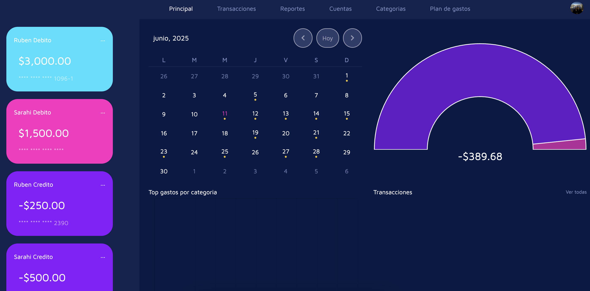
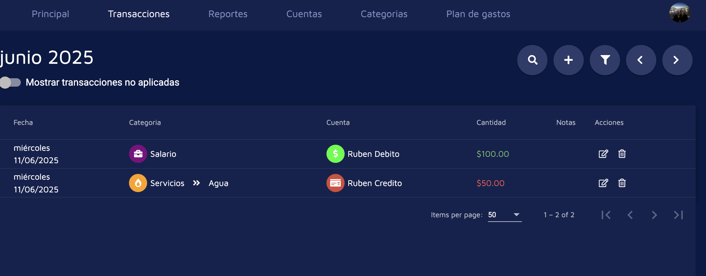
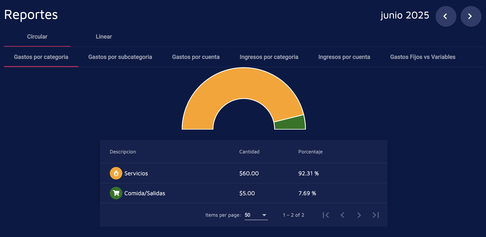
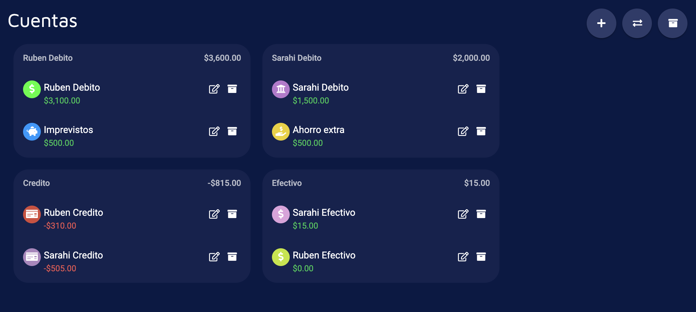
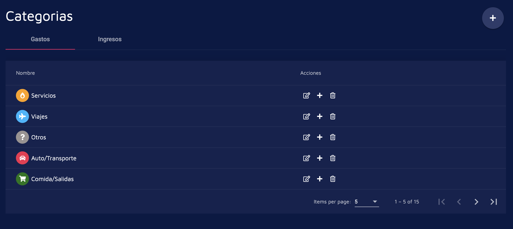
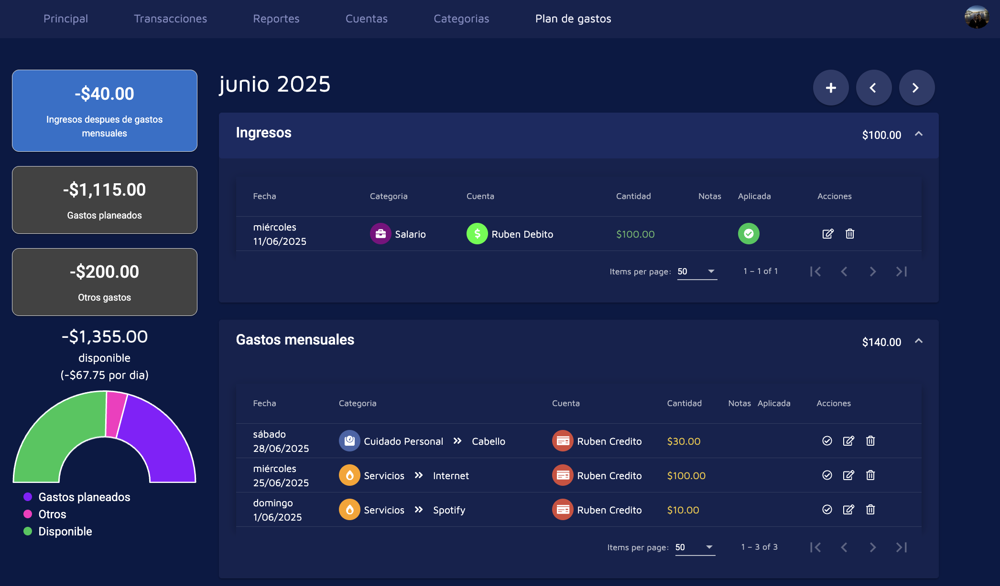
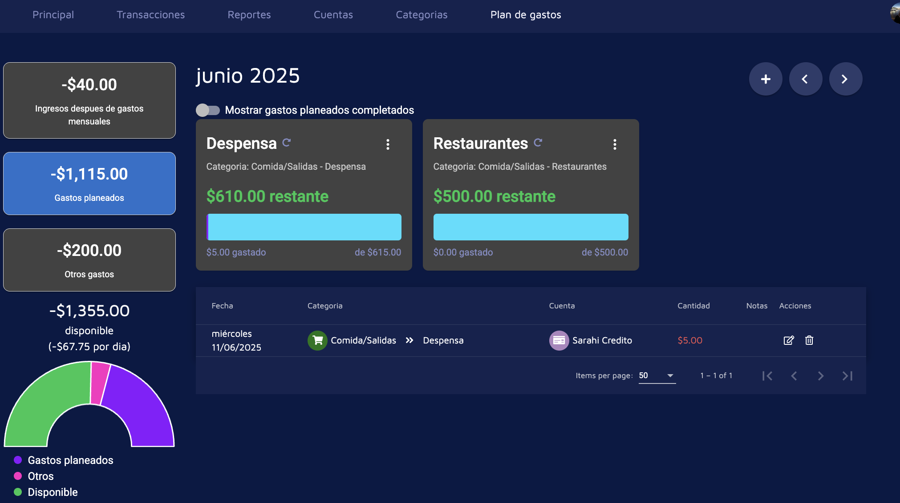
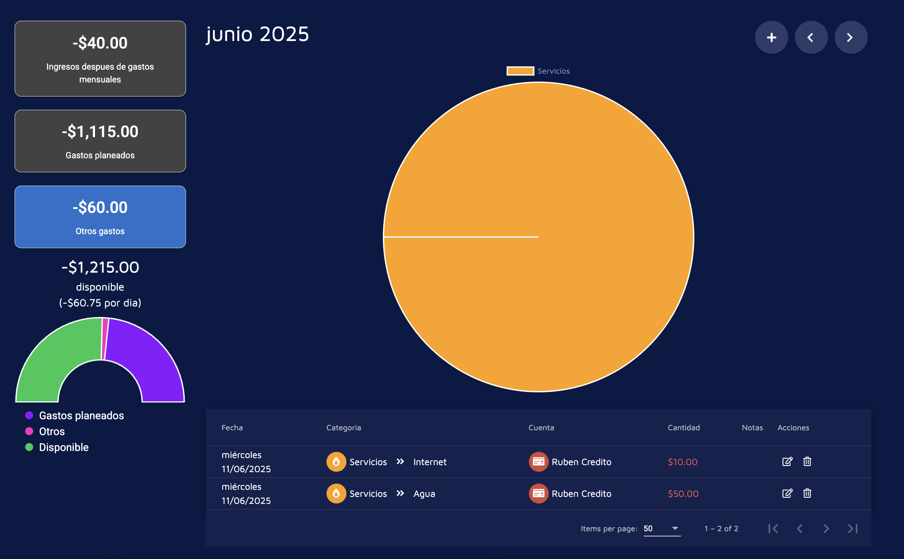

# BudgetManagerWeb

## Correr la aplicacion

Primero hay que definir un environment.ts que apunte a algun firebase emulador o consola de firebase en la nube

Despues puedes correr el comando
```ng serve```

### Emulador Firebase

Para levantar autenticacion y base de datos localmente puedes correr el comando:

```firebase emulators:start --export-on-exit=firebase-data --import=firebase-data```

### Ambientes

Para poderlo correr localmente se va a necesitar un archivo dentro de `src/environments/` que se llame `environments.ts`

La autenticacion esta chistosa y no funciona bien con un ambiente local, asi que necesitaras un segundo proyecto de pruebas para poder hacer la autenticacion.

Al final el archivo de ambiente se debe ver asi (todos los `SECRET` los puedes sacar de la consola de firebase):
```
export const environment = {
  production: false,
  firebase: {
    databaseURL: 'http://localhost:9000/?ns=budget-manager-14bf4',
    apiKey: "SECRET",
    authDomain: "SECRET",
    projectId: "SECRET",
    storageBucket: "SECRET",
    messagingSenderId: "SECRET",
    appId: "SECRET"
  }
};
```

### Demo

Dashboard principal:



Transacciones:



Reportes:



Cuentas:



Categorias:



Plan de Gastos - Ingresos:



Plan de Gastos - Gastos proyectados:



Plan de Gastos - Otros:

